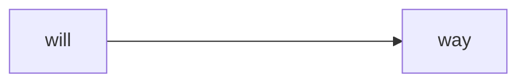
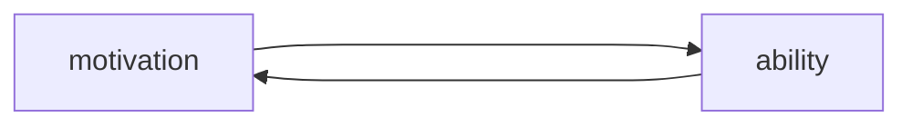
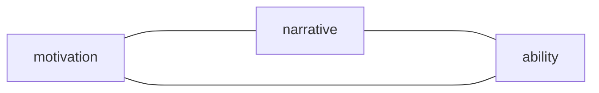
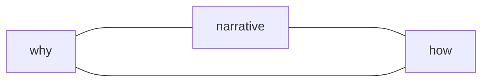

# Synergies Narrative

## Part0

```mermaid
graph LR;
will ------> way;
```

## Part1

```mermaid
graph LR;
motivation ------> ability;
ability --> motivation;
```

## Part2

```mermaid
graph LR;
motivation ----- narrative;
narrative ----- ability;
ability ---  motivation;
```

## Part3

```mermaid
graph LR;
why ----- narrative;
narrative ----- how;
how ---  why;
```
