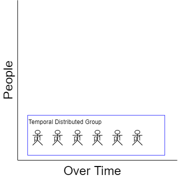
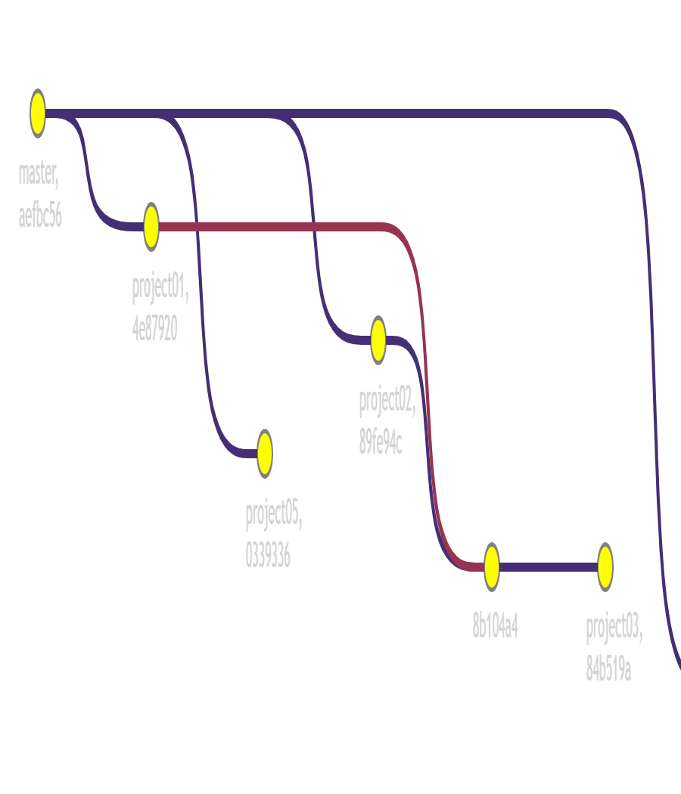
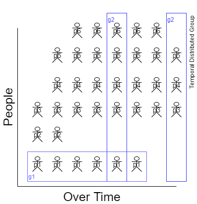
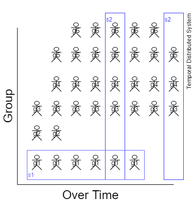
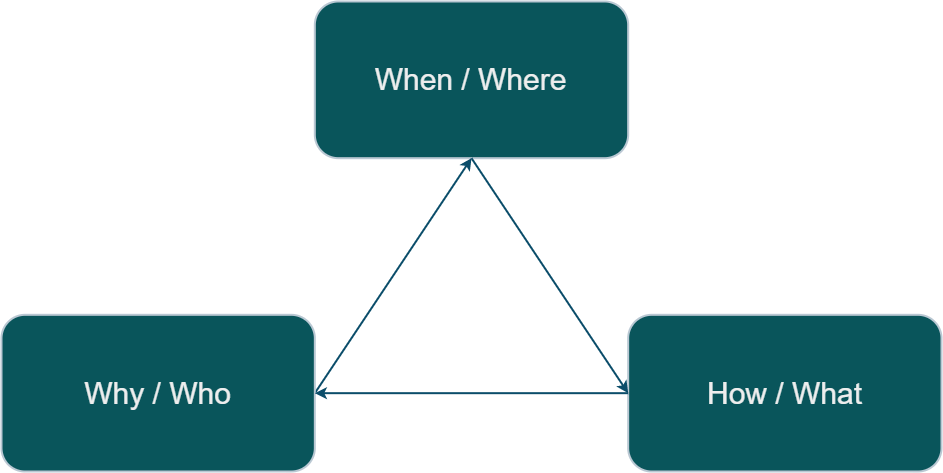
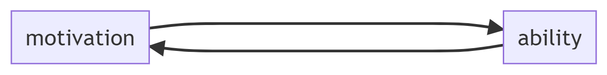

# Why?

* Since Pandemic I started to feel disconnected with work; I was worried about my career in these times. 
* I started on quest for quest to make my job more enjoyable.
* The behaviors that make work/job more enjoyable are also the behaviors that have greatest positive impact in our careers.

---

# How

* We will discuss (3) behaviors groups that helped me feel back in control of my projects and career.
* These are things that worked for me and I hope can get something out of these ideas to develop your own behaviors.
* Everybody's context is different. I hope to transmit the general idea which can motivate you to come up with specific implementations. 

---

# System Dimensionality (Scalar Nodes)

* Human Agents (Person, Team, System)
* Software Agents (Component, Cluster, System)

---

# Temporal System 
* Time scalar (Short, Medium, Long)  
   * Change is the only constant

---
# Complex system

* Engineering is very interesting in the aspect that while we humans are part of the system that we create, we are also able to create agents to remove toil and pain from our system. (There are trade offs)

---
# Agent grouping distributions

* While we have different names for human vs software we will standardize Singular, Group, System
* A singular agent across time forms a Group. Temporal distributed group. 
* Multiple agents that exist with the same temporal short term are a Group. They do not have to be active at the same time but must be available to become active. Temporal Concurrent group (distributed over space)
* An agent group (same identity) across time form a System. Temporal distributed system.

---

# Scope
* People and Software from same singular system.
   * Out of scope: The system over time.
* Time scale of short to medium term.

---

# Staging

<!--::: notes
- We will start with the individual person and a singular project (component).
- We will explore current, short term future, medium term future
- We will do a temporal shift to past (current), present (short term), future (medium term)
- This part is well understood
:::-->

---

# Staging Projects

<!--::: notes

- We will continue with the singular person but we will introduce multiple projects at different levels of progress.
- Some projects are fun while others are not.
- How does this individual feel motivated? (now add a pandemic on top of this)
- This part is somewhat understood.
:::-->

---
# Staging Groups

<!--::: notes
- We will imagine a team of individuals (each with different systems of components) that need to interact with each other. 
- New people being added, and people moving teams, projects changing ownership. 
- People agents and software agents over time.
- This part is somewhat understood.
:::-->
---
# Staging Groups

---

# Behavior #1: Clear Strategy

* Clear goals. (Know what to do next). 
* Clear signal of progression towards goals (Tight feedback loop)
* Challenging within margin of skill (Not too hard or easy. Just right) 
* Full control over the activity (Ownership / Authority) 

<!--::: notes
Attribution:  
Mihaly Csikszentmihályi (1990). Flow: The Psychology of Optimal Experience. 
https://en.wikipedia.org/wiki/Flow_(psychology)
:::-->

--- 

# Clear Strategy

* Agile methodology attempts to address this.
* Definition of done
* User Stories
* Iterative progress
* Well understood as Ability.
  - Can I do it? 

---

# Behavior #2: Intrinsic Drive

* Sense of Ownership 
* Feeling of Autonomy.
* Mastery (always improving)
* Somewhat understood as Motivation
  - Is it worth it?

<!--::: notes
Attribution:  

Drive: The Surprising Truth About What Motivates Us 
by Daniel H. Pink 
2011

Start with Why: How Great Leaders Inspire Everyone to Take Action 
by Simon Sinek

:::-->

---

# Intrinsic Drive

* Beyond Mission, Vision statement from company. 
* Motivation that can only be intrinsic to the individual.
* Can not come directly from delegation. 
* External motivations like money only temporarily boots motivation.

---

# Behavior #3:  Contextual Awareness

* The act of seeking awareness (as input) across the scalar dimensionality of people, software components, and time.
* The act of transporting awareness outside of their contextual environment into the future short term and medium term.
* Visibility of work over time.
* Somewhat understood as DCog (Distributed Cognition)

<!--::: notes
Attribution:

Now: The Physics of Time 
by Richard A. Muller

Distributed Cognition
https://en.wikipedia.org/wiki/Distributed_cognition

Cognitive System
https://ise.osu.edu/faculty-research/human-systems-integration/cognitive-systems-engineering

https://www.researchgate.net/profile/David-Woods-19
https://github.com/lorin/resilience-engineering#david-woods

:::-->
---

# Contextual Awareness

* Shared awareness of the group
* Cognitive Artifacts
* Share understanding of the group

<!--::: notes
* Focus on concrete behaviors that somebody can adopt.
* Understanding of the inner system. HOw to get understanding.

:::-->

---

# Cognitive Systems

* The trade off of Cognitive Artifacts is that is easier for somebody else to do your job. 

---

# How does this related to career?

* What are your Career OKR.
* Well being of the agent.

---
# Quest[ions]

---

# Path

---

# Back[Story]

<!--::: notes

Not included here are college jobs that would not qualify. For example, working at as a package loader motivated me to not want to do that as a career. The same goes for summer helping family with home construction projects.

:::-->

---

## Career: insights about levels

* Level in your career are more akin to different roles.
* It is not a ladder, is a different role.

---

