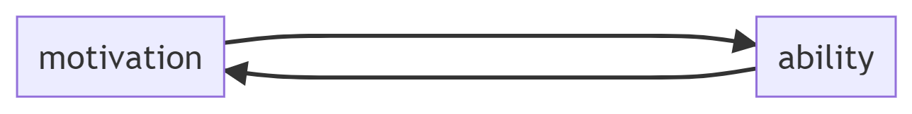
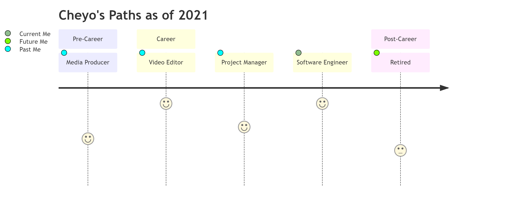

# What is your story?
* Our professional lives are part of our life narrative. It is not the whole story.
* It is up to you to control this narrative.

<!---::: notes
* ~12 years as of 2021
* Young professional figuring how to get paid for doing what I love
* Our professional life may take different paths but the journey is the same
:::--->
---

# Path

---

# Path 

---

# Back[Story]

<!---::: notes

Not included here are college jobs that would not qualify. For example, working at as a package loader motivated me to not want to do that as a career. The same goes for summer helping family with home construction projects.

:::--->

---

# Video Editor at NonProfit

<!---::: notes
* Motivation: Helping people in need and getting other people to help. Different than most traditional non profits.
* Ability: Creating digital artifacts to get more people involved in helping people.
* Learnings: How to work hard (Ability). Aligned to the mission (Motivation). Leadership and confidence (Motivation)
:::--->

---

# Project Manager at Portable Buildings Company

<!---::: notes
* Motivation: I was creating less and less digital content that I thought it might be better for me to switch career where they may be better pay.
* Ability: Work hard. Leadership and confidence. Support sales people to sell more structures.
* Learnings: International Travel is overrated. A company (where you work) should not be part of your identity. Money as a primary motivation did not work for me.
:::--->
---

# Software Engineer at Tech Company

<!---::: notes
* Motivation: I love to code.
* Ability: Create clarity from ambiguity. All previous abilities. 
* Learnings: More money doesn't remove career angst. 
Constant Mastery > arriving. Enjoy the journey > getting to a destination.
:::--->

---

# Path

---

## Narrative 

"If a tree were to fall on an island where there were no human beings would there be any sound?"
https://en.wikipedia.org/wiki/If_a_tree_falls_in_a_forest

---

# Path

---

# Narrative Context
- Back[Story]: Past (Also History)
- Story: Current (Learnings)
- User[Story]: Future (similar to Agile)

---

# Narrative/Context

<!---::: notes
* It is the manifestation of your _why_ you did something. Why you do what you do. Why will you do it again in the future. 
* It is the story of how you did something. How you are doing that thing now. And how you plan to improve.
* It is socializing ideas. Building communities. Leaving your mark in this world.
:::--->