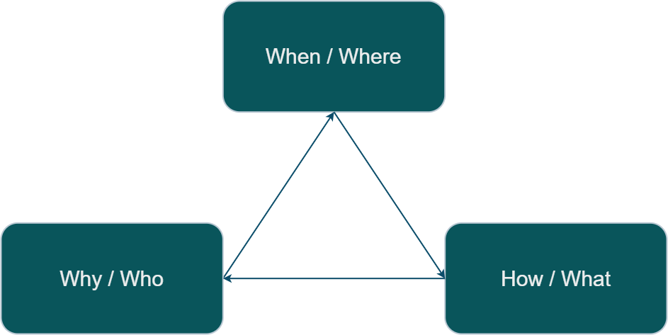

# Career Quest Engineering

Chéyo Jiménez, MSE
_Nov, 2021_

---

# Definitions
- Career
- Quest
- Engineering

I am going to try to convince you that this soup of words are related. 

---

# Career

According to [wikipedia](https://en.wikipedia.org/wiki/Career#Etymology) the word career comes from the latin _carrus_ which means chariot. The chariots of our time (cars) are powered by engines. The main purpose of a car is to provide movement in a similar manner that a career is meant to provide progression of one's profession.

Most folks think of a career ladder when thinking bout this. 

---

# Quest

According [etymonline](https://www.etymonline.com/word/quest) the word quest come from the latin root _quaere_ which means "to ask, inquire" and from Old French queste "search, quest, chase, hunt, pursuit; inquest, inquiry"

English words with the same root:
request, require, conquest, question, query, acquire

---

# Quest[ions]

---

# Quest[why]: the main quest[ino]

---

# Career [when][where] 

* In the career space-time continuum, where/when is a point somewhere in space-time career. 
* The arrow of time is constant and it is always moving forward.

---

# Engineering

---

# Engineering

According to [wikipedia](https://en.wikipedia.org/wiki/Engine#Terminology), the word engine comes from the Latin  _ingenium_ which is the root word for ingenious.

It is not a coincidence that engine and engineer only differ by the letters er at the end. The word engineer shares the same latin root of _ingenium_ with engine. According to [wikipedia](https://en.wikipedia.org/wiki/History_of_engineering) an _engine’er_ literally meant someone one who operates an engine.

---

# Quest Engine

