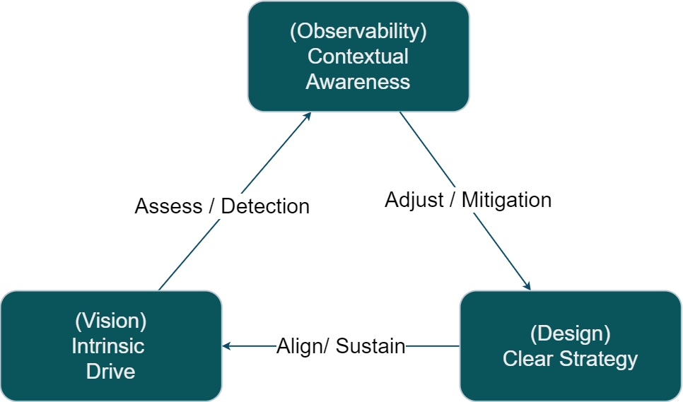

# Contextual Awareness

Chéyo Jiménez, MSE
_Oct, 2021_

---

# What is context?

- Past events recorded to be passed down to the future.
- Contextual
    - It depends on when, where.
- Static and Dynamic
    - Static wrt past revisions. Dynamic wrt to now.

---

# End goals
- Highlight behaviors that maximize context sharing
-  Stablish patterns to detect gaps in context and how to keep context alive

---

# Context about context
- It's contexts all the way down

---

# Etymology of context

- Root Latin `contextus`, from `con`- ‘together’ + `texere` ‘to weave’.
- Same root word as text.

---

# Human Context w.r.t Engineering product

- Folks Contributing (We will focus here)
- Folks using product

---

# Folks Contributing

- Async vs synchronous contribution
- ReadWrite vs ReadOnly
- Short Term vs (Mid to Long term) 
    - Fixing a bug vs Maintainer 

---

# Async Context ReadWrite Medium 

- Text
    - Markdown, Wiki, Word
- Visual
    - Graphics
        - Drawings
            - Paint app, photo of markerboard/smartboard, vector app.
    - Presentation
        - PowerPoint Slides
- Interactive
    - PR collaboration
    - Word document comments
    - Email

---

# Async Context ReadOnly Medium 

- Audio/Visual
    - Recorded presentation
- Documentation Website (No process to contribute)
    - Guides
        - Troubleshooting Guides
        - Tutorials

---

# Synchronous Context Medium
- Realtime Collaboration. 
    - Meeting, live chat, in person conversation
- Single use. Need to repeat for every new person or group of folks.
- Doesn't scale but they are useful.

---

# Desired qualities of context sharing
- Available in asynchronous medium in a way that is easy for the consumer and to contribute updates.
- Subject matter experts are available over asynchronous communication to help clarify questions. Sync meetings can be arranged on case by case basis as need arises (this should enhance asynchronous communication)

---

# Economics 

Tragedy of the commons
https://en.wikipedia.org/wiki/Tragedy_of_the_commons

---

# Software Observability

---
#  Observability via Telemetry

The three pillars of observability are as follows:

- Logs: A record of what’s happening within your software.
- Metrics: A numerical assessment of application performance and resource utilization.
- Traces: How operations move throughout a system, from one node to another.

Source https://www.ibm.com/cloud/blog/observability-vs-monitoring

---
# Model: Push vs Pull

- Crawler is a pull mode (On demand). 
- Agent that pushes is a push model. (Scheduled)

---
#  Observability is Contextual

- It depends on the observer (Audience). 
- The word `project` is ambiguous in this context. 

---
#  Project Architecture

- System (Software Service)
  - Subsystem
    - Component (Unit)
        - Subcomponent 

---
#  Audience Encapsulation

- High Level: Project Leadership
    - Service Level Agreement (SLA) (Public)
- Med Level: Engineering Leadership
    - Service Level Objectives (SLO) (Internal)
- Low Level: Engineers
    - Service Level Indicators (SLI) (Private)
<!--::: notes
Reference:
https://www.atlassian.com/incident-management/kpis/sla-vs-slo-vs-sli

:::-->