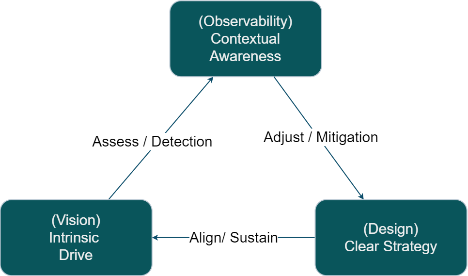

# Contextual Awareness

Chéyo Jiménez, MSE
_Oct, 2021 (Updated Apr 2026 - Framework 4.0)_


---

# What is context?

- Past events recorded to be passed down to the future.
- Contextual
    - It depends on when, where.
- Static and Dynamic
    - Static wrt past revisions. Dynamic wrt to now.


---

# End goals
- Highlight behaviors that maximize context sharing
-  Stablish patterns to detect gaps in context and how to keep context alive


---

# Context about context
- It's contexts all the way down


---

# Three Sub-Pillars of Contextual Awareness

**Cycle Phase**: Prospective (KNOWING the environment)
**Framework**: OODA loop (Observe + Orient), Robotics Perception, Search Engines
**Robotics Foundation**: Perception (sensors, SLAM, environment mapping)

1. **Proactive Curiosity** - Systematically discover and index knowledge
2. **Cohesive Narrative** - Build mental models through cognitive artifacts
3. **Shared Understanding** - Externalize knowledge for organizational memory

---

# Framework 4.0 Context

**Contextual Awareness** is the **Prospective** phase in the operational cycle:

```
Objective Function (WHY)
         ↓
Prospective (KNOWING) → Actuation (ACTING) → Retrospective (LEARNING)
     ↑
You are here
```

Understanding the environment before acting.

---

# Sub-Pillar 1: Proactive Curiosity

**Systematically find and organize information for retrieval**

- Crawl Your Domain (code, docs, people, systems)
- Index for Retrieval (search-friendly, metadata, cross-references)
- Multi-Sensor Fusion (combine code, logs, metrics, docs, people)
- Continuous Refresh (fight information decay)
- Scout Mindset (actively seeking truth)

**Theoretical Roots**: Search engines, robotics sensors, OODA Observe, Information Foraging Theory

---

# Sub-Pillar 2: Cohesive Narrative

**Create accurate mental models and continuously update them**

- Create Mental Models (architecture, data flow, business logic)
- Update Models Continuously (SLAM replanning - reality check)
- Contextualize Information (audience-aware: SLA/SLO/SLI)
- Map Dependencies (component, data, team dependencies)
- Build narrative through cognitive artifacts

**Theoretical Roots**: Robotics SLAM, OODA Orient, mental models theory, cognitive artifacts

---

# Sub-Pillar 3: Shared Understanding

**Externalize knowledge into durable cognitive artifacts**

- Create Cognitive Artifacts (docs, ADRs, diagrams, runbooks)
- Maintain the Commons (fight knowledge decay, ownership, review cycles)
- Systemic Incentives (make it easy, visible, required, integrated, rewarded)
- Async-First Context Sharing (documentation default, meetings case-by-case)

**Theoretical Roots**: Cognitive artifacts (Donald Norman), distributed cognition, tragedy of the commons

**From original "Economics: Tragedy of the commons"**

- Context as Shared Resource
  - Benefits: Everyone gains from good docs
  - Costs: Individual time to create/maintain
  - Problem: Everyone consumes, few contribute
- Systemic Solutions:
  - Make it Easy (reduce cost)
  - Make it Visible (reward contributors)
  - Make it Required (enforce via process)
  - Make it Integrated (docs live with code)
- Context Decay: Half-life of knowledge without maintenance

---

# Etymology of context

- Root Latin `contextus`, from `con`- 'together' + `texere` 'to weave'.
- Same root word as text.


---

# Human Context w.r.t Engineering product

- Folks Contributing (We will focus here)
- Folks using product


---

# Folks Contributing

- Async vs synchronous contribution
- ReadWrite vs ReadOnly
- Short Term vs (Mid to Long term) 
    - Fixing a bug vs Maintainer 


---

# Async Context ReadWrite Medium 

- Text
    - Markdown, Wiki, Word
- Visual
    - Graphics
        - Drawings
            - Paint app, photo of markerboard/smartboard, vector app.
    - Presentation
        - PowerPoint Slides
- Interactive
    - PR collaboration
    - Word document comments
    - Email


---

# Async Context ReadOnly Medium 

- Audio/Visual
    - Recorded presentation
- Documentation Website (No process to contribute)
    - Guides
        - Troubleshooting Guides
        - Tutorials


---

# Synchronous Context Medium
- Realtime Collaboration. 
    - Meeting, live chat, in person conversation
- Single use. Need to repeat for every new person or group of folks.
- Doesn't scale but they are useful.


---

# Desired qualities of context sharing
- Available in asynchronous medium in a way that is easy for the consumer and to contribute updates.
- Subject matter experts are available over asynchronous communication to help clarify questions. Sync meetings can be arranged on case by case basis as need arises (this should enhance asynchronous communication)


---

# Economics 

Tragedy of the commons
https://en.wikipedia.org/wiki/Tragedy_of_the_commons

---

# Software Observability



---
#  Observability via Telemetry


The three pillars of observability are as follows:

- Logs: A record of what’s happening within your software.
- Metrics: A numerical assessment of application performance and resource utilization.
- Traces: How operations move throughout a system, from one node to another.

Source https://www.ibm.com/cloud/blog/observability-vs-monitoring

---
# Model: Push vs Pull

- Crawler is a pull mode (On demand). 
- Agent that pushes is a push model. (Scheduled)

---
#  Observability is Contextual

- It depends on the observer (Audience). 
- The word `project` is ambiguous in this context. 

---
#  Project Architecture

- System (Software Service)
  - Subsystem
    - Component (Unit)
        - SubComponent


---
#  Audience Encapsulation

- High Level: Project Leadership
    - Service Level Agreement (SLA) (Public)
- Med Level: Engineering Leadership
    - Service Level Objectives (SLO) (Internal)
- Low Level: Engineers
    - Service Level Indicators (SLI) (Private)
<!--::: notes
Reference:
https://www.atlassian.com/incident-management/kpis/sla-vs-slo-vs-sli

:::-->

---

# Integration with Framework 4.0

**Prospective (KNOWING)** connects to:

**→ To Actuation (ACTING)**:
- Clear Strategy uses the context we've built
- Mental models inform goal-setting and execution
- Cognitive artifacts enable informed decision-making

**→ From Retrospective (LEARNING)**:
- Reflective Convergence enriches our knowledge
- Pattern recognition improves mental models
- Model updates become shared understanding

**↑ Guided by Objective Function (WHY)**:
- Defines what success means for any agent (human or AI)
- Human: Intrinsic Motivation drives curiosity and learning
- Agent: Reward function guides information gathering